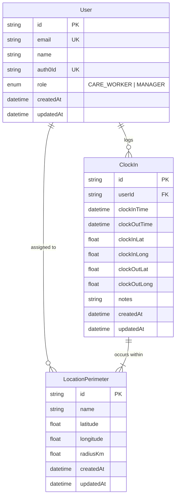

# 🏥Healthcare Clock-In System

A Next.js application for managing healthcare worker clock-ins and attendance tracking.

## Tech Stack

- **Framework**: Next.js 14 (App Router)
- **Language**: TypeScript
- **Authentication**: Auth0
- **Database**: Supabase with Prisma ORM
- **UI Framework**: Ant Design (antd)
- **Date Handling**: Day.js

## Getting Started

### Prerequisites

- Node.js 18+
- npm/yarn
- Supabase account
- Auth0 account

### Environment Setup

Create a `.env.local` file in the root directory:

```env
# Auth0 Configuration
AUTH0_SECRET='use [openssl rand -hex 32] to generate'
AUTH0_BASE_URL='http://localhost:3000'
AUTH0_ISSUER_BASE_URL='your-auth0-domain'
AUTH0_CLIENT_ID='your-client-id'
AUTH0_CLIENT_SECRET='your-client-secret'

# Database Configuration
DATABASE_URL="your-supabase-connection-string"
```

### Installation

```shell
# Install dependencies
npm install

# Setup database
npx prisma generate
npx prisma db push

# Run development server
npm run dev
```

## Project Structure

```
src/
├── app/              # Next.js 14 App Router
│   ├── api/          # API Routes
│   ├── clock/        # Clock In/Out Page
│   ├── dashboard/    # Manager Dashboard
│   ├── history/      # Clock-in History
│   ├── staff/        # Staff Details
│   └── layout.tsx    # Root Layout
├── components/       # Reusable Components
├── lib/              # Utilities and Configurations
└── scripts/          # Database Scripts
```

## Core Features

### Authentication
- Auth0 integration for secure login/logout
- Role-based access control (Manager/Care Worker)
- Protected API routes and pages

### Clock In/Out System
- Basic clock in/out functionality
- Status tracking
- Historical record keeping

### Manager Dashboard
- Real-time staff status overview
- Current clock-in status
- Staff statistics
- Individual staff member profiles

### Staff History
- Detailed clock-in records
- Date range filtering
- Duration calculations

## API Routes

### Staff Details
```typescript
GET /api/staff/[id]
Response:
{
  "id": "string",
  "name": "string",
  "email": "string",
  "role": "string",
  "totalHours": number,
  "averageHoursPerDay": number,
  "clockInHistory": [
    {
      "id": "string",
      "clockInTime": "string",
      "clockOutTime": "string | null",
      "notes": "string | null"
    }
  ]
}
```

### Dashboard Statistics
```typescript
GET /api/dashboard/stats
Response:
{
  "activeStaff": number,
  "totalStaff": number,
  "recentClockIns": [
    {
      "id": "string",
      "name": "string",
      "status": "string",
      "lastClockIn": "string",
      "hoursToday": number
    }
  ]
}
```

### Clock In/Out
```typescript
POST /api/clock-in
Response:
{
  "success": true,
  "clockInTime": "string"
}

POST /api/clock-out
Response:
{
  "success": true,
  "clockOutTime": "string"
}
```

## Development Notes

### Auth0 Setup
1. Create a new application in Auth0.
2. Configure callback URLs:
   - **Allowed Callback URLs**: `http://localhost:3000/api/auth/callback`
   - **Allowed Logout URLs**: `http://localhost:3000`
3. Copy credentials to `.env.local`.

### Database Setup
1. Create a new Supabase project.
2. Copy the connection string to `DATABASE_URL` in `.env.local`.
3. Run Prisma migrations.

## 🏰️ Architecture


## Known Issues

1. **Auth0 cookie warnings** in development (non-critical).
2. **Table `filteredValue` warnings** in the staff details page.
3. **Next.js params handling warnings** (to be addressed in a future update).

## Scripts

### Database Seeding
```sql
-- Available in src/scripts/seed-demo-data.sql
-- Creates demo users and clock-in records
```

## Contributing

- Follow **TypeScript strict mode**.
- Ensure **proper error handling**.
- Maintain **existing code structure**.
- Test **thoroughly before submitting a PR**.


